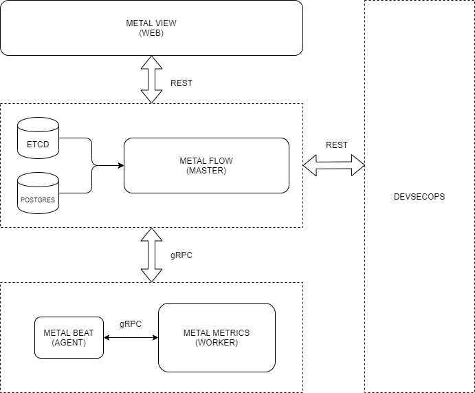

# metalbeat

[](https://github.com/craftslab/metalbeat/actions?query=workflow%3ACI)
[](https://hub.docker.com/r/craftslab/metalbeat)
[](https://goreportcard.com/report/github.com/craftslab/metalbeat)
[](https://github.com/craftslab/metalbeat/blob/master/LICENSE)
[](https://github.com/craftslab/metalbeat/tags)


## Introduction

*metalbeat* is an agent of *[metalflow](https://github.com/craftslab/metalflow/)* written in Go.


## Prerequisites

- Go >= 1.15.0
- etcd == 3.3.25
- gRPC == 1.26.0


## Build

```bash
git clone https://github.com/craftslab/metalbeat.git

cd metalbeat
make build
```


## Run

```bash
./metalbeat --config-file="config.yml" --host-addr="127.0.0.1"
```


## Docker

```bash
git clone https://github.com/craftslab/metalbeat.git

cd metalbeat
docker build --no-cache -f Dockerfile -t craftslab/metalbeat:latest .
docker run -it craftslab/metalbeat:latest ./metalbeat --config-file="config.yml" --host-addr="127.0.0.1"
```


## Usage

```bash
usage: metalbeat --config-file=CONFIG-FILE --host-addr=HOST-ADDR [<flags>]

Metal Beat

Flags:
  --help                     Show context-sensitive help (also try --help-long
                             and --help-man).
  --version                  Show application version.
  --config-file=CONFIG-FILE  Config file (.yml)
  --host-addr=HOST-ADDR      Host address
```


## Settings

*metalbeat* parameters can be set in the directory [config](https://github.com/craftslab/metalbeat/blob/master/config).

An example of configuration in [config.yml](https://github.com/craftslab/metalbeat/blob/master/config/config.yml):

```yaml
apiVersion: v1
kind: agent
metadata:
  name: metalbeat
spec:
  sd:
    host: 127.0.0.1
    name: etcd
    port: 2379
```


## Etcd

- Agent

```
key: /metalflow/agent/{HOST}/name
val: metalbeat
```

- Master

```
key: /metalflow/worker/{HOST}/image
val: pull|restart|rm|start|stop

key: /metalflow/worker/{HOST}/name
val: metalmetrics

key: /metalflow/worker/{HOST}/port
val: 9090
```


## Design




## License

Project License can be found [here](LICENSE).


## Reference

- [etcd](https://etcd.io/docs/)
- [go-kit](https://github.com/go-kit/kit)
- [go-zero](https://github.com/tal-tech/go-zero)
- [gRPC](https://grpc.io/docs/languages/go/)
- [protobuf](https://developers.google.com/protocol-buffers/docs/proto3)
